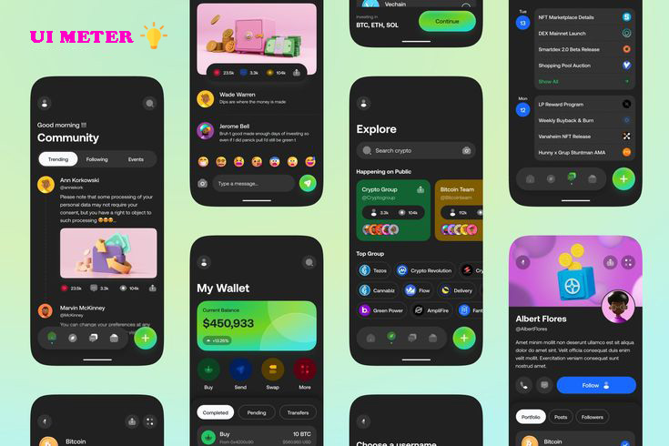

# React Native UI Meter Cli 
Introducing our comprehensive React Native UI library, designed to streamline your app development process. This library includes customizable App Themes, Cross-platform compatibility for both iOS and Android & web a rich collection of pre-built components, powerful hooks, intuitive form state management, and integrated query handling for efficient data management. With this library, you can create beautiful, functional, and responsive applications effortlessly, providing a seamless and efficient development experience.



## Initialize cli configuration  

```sh
npx rn-meter init
```

## Features

- App Theme
- Cross platform Universal
- Components
- Hooks
- From state handle
- Query support

## API Reference

- [Installation](#initialize-cli-configuration)
- [Configuration](#configuration)
    - [Theme Setup](#theme-setup)
    - [Eslint Setup](#eslint-setup)
    - [Vs Code Configuration Setup](#vs-code-configuration-setup)
    - [Setup Alias](#setup-alias)

- [Animations](#animations)
  - [Chart](#chart)
    - [Pai Chart](#pai-chart)
- [Components](#components)
  - [Layout](#layout-components)
    - [Box](#box)
    - [Center](#center)
    - [HStack](#hstack)
    - [VStack](#vstack)
    - [Divider](#divider)
    - [Alert](#alert)
    - [Toast](#toast)
  - [Typography](#typography)
    - [Text](#text)
    - [Heading](#heading)
  - [From](#from-components)
    - [Button](#button)
    - [CheckBox](#checkbox)
    - [Radio](#radio)
    - [Switch](#switch)
    - [Input](#input)
    - [Animated Input](#animated-input)
  - [Helping UI Components](#helping-ui-components)
    - [Carousal](#carousal)
    - [KeyboardAvoidingScrollView](#keyboardavoidingscrollview)
    - [Bottom Sheet](#bottom-sheet)
- [Utils Function](#utils-function)
  - [Random](#random-id-generator-function)
  - [Color Opacity reducer](#color-opacity-reducer-function)
- [Build App Configuration](#build-app-configuration)
  - [Generate Apk](#generate-apk)
  - [Generate ABB](#generate-abb)
  - [Update Apk](#update-apk)
  - [Update ABB](#update-abb)
  - [Change Name](#change-name)
- [Native Api Mobile](#native-api-mobile)
  - [Audio](#audio)

- [Contributing](#contributing)
- [Support](#support)
- [Feedback](#feedback)
- [FAQ](#faq)
- [Links](#links)
- [Authors](#authors)
- [License](#license)

## Configuration
### Theme Setup
This Command setup your theme related configuration. Like Font, color, radius, etc, also create a meter.config file . You can customize all of this. 
```
npx rn-meter setup theme
```

### Eslint Setup
We are flowing Airbnb style. you can also customize all of role in .eslintrc.json file.

⚠️ **WARNING: CRITICAL ACTION REQUIRED!** ⚠️  
Before running this command, you **MUST** remove all ESLint-related configuration files like `.eslintrc.json` and uninstall all ESLint-related packages. Failure to do so **WILL** cause issues in your project. Proceed with caution!


```
npx rn-meter setup eslint
```

### Vs Code Configuration Setup
This setup for customizing vs code editor. we can fix all of linting related error passing ctrl+s 

⚠️ **WARNING: CRITICAL ACTION REQUIRED!** ⚠️ 
Before running this command, you **MUST** remove all vs code-related configuration files like `.vscode/settings.json ` . Failure to do so **WILL** cause issues in your project. Proceed with caution!

```
npx rn-meter setup vscode config
```


### Setup Alias
```
npx rn-meter setup alias
```
## Animations
### Chart
#### Pie Chart
* ⚙️ **Setup Note:**  
 * Make sure you have installed and configured:
 * - `@shopify/react-native-skia`
 * - `react-native-reanimated`
 * 
```
npx rn-meter add piechart1
```

## Components

Introducing our comprehensive React Native UI library with customizable themes, universal components, powerful hooks, efficient form state handling, and integrated query support. Create beautiful, functional, and responsive applications effortlessly.
### Layout Components
#### Box
```
npx rn-meter add box 
```
#### Center
```
npx rn-meter add center 
```

#### HStack
```
npx rn-meter add HStack 
```

#### VStack
```
npx rn-meter add VStack 
```

#### Divider
```
npx rn-meter add divider 
```

#### Alert
```
npx rn-meter add alert 
```
#### Toast
```
npx rn-meter add toast 
```


### From Components
#### Button
```
npx rn-meter add button 
```

#### CheckBox
```
npx rn-meter add checkbox 
```

#### Radio
```
npx rn-meter add radio 
```
#### Switch
```
npx rn-meter add switch 
```
#### Input
```
npx rn-meter add input 
```

#### Animated Input
```
npx rn-meter add animated input 
```

### Animated Components


### Helping UI Components
#### Carousal
```
npx rn-meter add carousal 
```

#### KeyboardAvoidingScrollView
```
npx rn-meter add keyboardAvoidingScrollView 
```

#### Bottom  Sheet
```
npx rn-meter add bottom sheet 
```

## Utils Function

#### Random Id Generator Function
This function using for create random string id generation 
```
npx rn-meter add fn random
```

#### Color Opacity Reducer Function
This function using for reducing color opacity
```
npx rn-meter add fn cor
```

## Build App Configuration
**This command is coming soon** 

#### Generate Apk
```
npx rn-meter generate apk
```

#### Generate ABB
```
npx rn-meter generate abb
```

#### Update Apk
```
npx rn-meter update apk
```
#### Update ABB
```
npx rn-meter update abb
```
### Change Name
This Command is only for change your app name
```
npx rn-meter change name
```

## Native Api Mobile

#### Audio

This hook provides a complete utility for recording, playing, listing, and managing audio files in your React Native app.

## 🔧 Libraries Used

- 🎙️ [react-native-audio-record](https://github.com/goodatlas/react-native-audio-record) – Record audio with native support.
- 🔓 [react-native-permissions](https://github.com/zoontek/react-native-permissions) – Handle runtime permissions easily.
- 🔊 [react-native-sound-player](https://github.com/johnsonsu/react-native-sound-player) – Play audio from local or remote sources.

Install the required dependencies and setup flowing library instructions

```bash
npm install react-native-audio-record react-native-permissions react-native-sound-player
```

```
npx rn-meter add audio record
```

#### Using Example (`App.tsx`)
```tsx
  // Provide audio provider 
  import React from 'react';
  import AudioProvider from './src/AudioProvider';
  import Audio from './src/Audio';

  export default function App() {
    return (
      <AudioProvider>
        <Audio/>
      </AudioProvider>
    );
  }
```

#### Audio.tsx
```jsx
// use like this 
import { StyleSheet, Text, TouchableOpacity, View } from 'react-native';
import React from 'react';
import useAudio from './useAudio';

export default function Audio() {
   const {startRecording,stopRecording, playRecording, stopPlayer, getAllRecording, getLastRecording, deleteAllRecording, deleteRecordingById} = useAudio();

  return (
    <View style={styles.container}>
        <TouchableOpacity
        // disabled={isRecording}
        // style={{opacity: isRecording ? 0.7 : 1}}
        onPress={startRecording}
        >
        <Text style={styles.btn}>Start</Text>
        </TouchableOpacity>

        <TouchableOpacity
        // disabled={!isRecording}
        // style={{opacity: !isRecording ? 0.7 : 1}}
        onPress={stopRecording}>
        <Text style={styles.btn}>Stop</Text>
        </TouchableOpacity>

        <TouchableOpacity onPress={()=>playRecording()}>
            <Text style={styles.btn}>Play</Text>
        </TouchableOpacity>

        <TouchableOpacity onPress={stopPlayer}>
            <Text style={styles.btn}>Stop Player</Text>
        </TouchableOpacity>

        <TouchableOpacity onPress={getAllRecording}>
            <Text style={styles.btn}>get all recording</Text>
        </TouchableOpacity>

        <TouchableOpacity onPress={getLastRecording}>
            <Text style={styles.btn}>get last recording</Text>
        </TouchableOpacity>

        <TouchableOpacity onPress={deleteAllRecording}>
            <Text style={styles.btn}>delete all recording</Text>
        </TouchableOpacity>

        <TouchableOpacity onPress={()=>deleteRecordingById('recorder-salespype-1744540057355.wav')}>
            <Text style={styles.btn}>delete recording by id</Text>
        </TouchableOpacity>
    </View>
  );
}

const styles = StyleSheet.create({
  container:{
    flex:1,justifyContent:'center',alignItems:'center', gap: 10,
  },
  btn:{
    backgroundColor:'blue', paddingHorizontal: 10, paddingVertical: 5, color:'#fff',fontWeight:'bold',
  },
});
 
```


## Contributing

Pull requests are welcome. For major changes, please open an issue first
to discuss what you would like to change.

Please make sure to update tests as appropriate.

## Support

For support, email devrejaul.official@gmail.com

## Feedback

If you have any feedback, please reach out to us at devrejaul.official@gmail.com

## FAQ

#### Question 1

Answer 1

#### Question 2

Answer 2

## 🔗 Links

[](https://www.linkedin.com/in/rezaul-karim-823a9a227/)
[](https://x.com/DeveloperRejaul)

## Authors

- [@rezaulkarim](https://github.com/DeveloperRejaul)

## License

[MIT](https://choosealicense.com/licenses/mit/)
